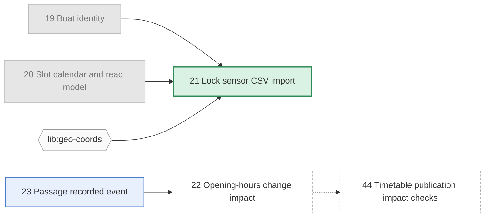

# Brindley — Format Specification (DRAFT)

*Design fully before anyone digs.*

> Status: **draft**, shaped by real-world use of numbered initiative files and the agents that
> implement them. See Appendix A for what that use showed.
>
> **Brindley** is named after James Brindley, engineer of Manchester's Bridgewater Canal, who
> worked his designs out completely before construction began.

## 1. Purpose

A plain-Markdown, in-repo convention for planning work that AI agents (and humans) can read,
reason over, and act on. Each unit of work is an **initiative**: one Markdown file with a small
block of structured front-matter and a free-form, prose-first body. Initiatives live in git
alongside the code they describe, so planning is versioned, branched, reviewed and merged exactly
like code.

Typical lifecycle:

1. A human and an agent iterate on an initiative's design (on the main branch) until it is
   design-complete.
2. An implementing agent picks up one initiative whose dependencies are done, implements it (e.g.
   in a git worktree), rewrites the initiative to describe what is now true, marks it **done** in the
   same change, and merges back.

### Design principles

- **Works with zero tooling.** A text editor and an agent that reads Markdown are sufficient.
  Tooling makes it easier, never required.
- **Nothing moves.** A file's path never changes after creation, so links to it — and links from it
  to its assets — never break. Status lives in front-matter, not folder location.
- **Prose first.** Initiatives are design documents. The format standardises only the handful of
  facts tools need (number, status, dependencies); everything else is the author's.
- **Readable on GitHub.** Rendered files and collection READMEs should be useful to a human
  browsing the repo.
- **Small core, versioned.** The format carries a version number so it can evolve.
- **Docs say what is; initiatives say why.** Project documentation describes only the current
  code. History, rationale and rejected alternatives belong in initiatives, never in the docs
  (§7.1).

## 2. Collections and layout

> Examples throughout this spec use a fictional system that lets boat captains book a slot to take
> their boat through a canal lock, ascending or descending.

A repo has **one initiatives root** directory. Beneath it, initiatives are grouped into
**collections** — the larger changesets (themes, epics, tickets) that individual initiatives
belong to. Each collection is one flat directory:

```
docs/initiatives/                                  # the root (one per repo)
  README.md                                        # root front-matter + generated overview of collections
  LOCK-42/
    slot-booking/                                  # a collection
      README.md                                    # collection overview + generated index (§8)
      19-boat-identity.md
      20-slot-calendar-and-read-model.md
      21-lock-sensor-import.md
      21-sensor-readings/                          # assets belonging to initiative 21 (§3)
        castlefield-lock-2026-09.csv
      39-paged-slot-listings.md
  search-rework/                                   # another collection
    README.md
    1-query-parser.md
```

**Root.** The root's `README.md` carries root front-matter, which is how tools find it:

```yaml
---
brindley: 1            # marks the initiatives root; value = format version
agent: .github/agents/implement-initiative.agent.md   # optional default repo workflow, see §9
docs: ["docs/**/*.md", "*/docs/**/*.md"]              # optional: what counts as project docs, see §7.1
---
```

Tools look for the root at `initiatives/` then `docs/initiatives/`, or take an explicit path.
There is exactly one root per repo.

**Collections.** Any directory under the root that directly contains initiative files is a
collection. Its identity is its path relative to the root (`LOCK-42/slot-booking`,
`search-rework`) — so collections can be grouped one or more levels deep however suits the
project, but initiatives are always directly inside their collection. Its `README.md` has optional
front-matter:

```yaml
---
title: LOCK-42 lock slot booking
status: active          # active | done | abandoned — of the changeset as a whole
agent: .github/agents/slot-booking.agent.md   # overrides the root default
docs: ["services/locks/docs/*.md"]              # docs this changeset usually affects
---
```

- **No status sub-folders** (no `completed/`).
- A file in a collection directory is an initiative iff its name matches `<number>-<slug>.md`.
- Initiative files directly in the root, outside any collection, are not allowed (validation error).

## 3. Identity, filenames and assets

- Every initiative has a **number**: a positive integer, unique within its collection, allocated
  sequentially (next = highest existing + 1). People say "do 39"; the format keeps that.
- Filename: `<number>-<slug>.md`. No zero-padding (`21-…`, not `0021-…`).
- **The filename is permanent.** Retitling changes the H1 only; the slug is not updated. This is
  the price of never-breaking links.
- **Assets** (fixtures, diagrams, samples) live in a sibling directory whose name starts with the
  same number: `<number>-<anything>/`. Because neither file nor directory ever moves, relative links
  between them stay valid.
- **Referencing** an initiative:
  - same collection: by number in front-matter (`20`), by relative link in prose
    (`[20](20-slot-calendar-and-read-model.md)`);
  - another collection: `"<collection>#<number>"` in front-matter
    (`"search-rework#1"`), relative link in prose (`[query parser](../../search-rework/1-query-parser.md)`).
    Because there is one root, these are checkable just like same-collection references.

**Collision handling.** Numbers are allocated where design happens — normally the main branch, one
author at a time — so collisions are rare. Tooling should reduce them further by scanning other
worktrees, branches and history before coining a number, and should never reuse the number of a
deleted initiative. When two branches do allocate the same number, it shows
up as two files with the same prefix after merge; validation (§10) flags it and the later one is
renumbered (a tool can do this, rewriting the few links involved).

## 4. Front-matter

YAML front-matter, delimited by `---`. Deliberately small:

```yaml
---
status: draft
depends_on: [19, 20, "lib:geo-coords"]
related: [30]
owner: locks/core
updated: 2026-09-24
---
# Lock sensor CSV import
```

| Field        | Required | Type | Notes |
|--------------|----------|------|-------|
| `status`     | yes      | enum | See §5. |
| `status_note` | no      | string | One-line qualifier shown next to the status, e.g. "synchronous impact validation on publish" or "design proposal, no implementation yet". |
| `depends_on` | no       | list | **Hard prerequisites.** An integer is an initiative in this collection; `"<collection>#<n>"` is an initiative in another collection; any other string is an **external** prerequisite (module, other repo) that tools record but cannot check. Default `[]`. |
| `related`    | no       | list | Soft links: "informed by, but does not depend on". Integers or `"<collection>#<n>"`. Never blocks. |
| `owner`      | no       | string | Owning team/module/person. |
| `updated`    | no       | ISO date | Last meaningful change. Tools set it; humans may. |
| `superseded_by` | conditional | integer | Required when `status: superseded`. |
| `tags`       | no       | list of strings | Free-form. |
| `docs`       | no       | list of paths | Project docs this initiative is expected to change (§7.1). Filled in during design, corrected during implementation. |
| `docs_impact` | on `done` | list of paths, or `none: <reason>` | Project docs actually updated, or an explicit statement that none were affected and why (§7.1). |

- The **title is the document's H1**, not a front-matter field — it is what people edit and what
  GitHub shows.
- The format version is declared once, on the collection (§2), not per file.
- Unknown fields are permitted and must be preserved by tools (extension point).

## 5. Status lifecycle

Core statuses (closed set in format v1):

```
draft ──► designed ──► in-progress ──► done
  │           │              │
  └───────────┴──────────────┴──► abandoned | superseded
```

| Status        | Meaning |
|---------------|---------|
| `draft`       | Being designed ("proposed"). |
| `designed`    | Design complete: an implementing agent can act without asking product questions. |
| `in-progress` | Being implemented. |
| `done`        | Implemented and merged; the body describes what is true now (§7). |
| `abandoned`   | Will not be done. |
| `superseded`  | Replaced by another initiative (`superseded_by`). |

**Readiness is derived, never stored.** For an initiative with `status: designed`, each entry in
`depends_on` is classified as:

| Classification | Meaning |
|----------------|---------|
| satisfied      | initiative dependency (same or other collection) with `status: done` |
| blocking       | initiative dependency not yet `done` |
| external       | other string dependency — cannot be checked; must be confirmed by the implementer |

The initiative is **ready** when nothing is blocking. External dependencies don't block readiness
but are always surfaced to the implementing agent. Storing readiness would mean rewriting dependants
whenever a dependency completes — the problem this format exists to avoid.

Transition rules:

- `draft → designed` requires no unresolved blocking open questions (§6).
- Moving backwards (e.g. `designed → draft` when a new question surfaces) is allowed.
- `done` is set **in the same commit as the implementation**, so status and code land together.

## 6. Body

The body is free-form prose. Recommended sections, roughly in order (names are conventions, not
requirements, except where marked):

| Section | Purpose |
|---------|---------|
| `## Goal` or `## Context` | What and why. |
| `## Dependencies` | **Narrative** for `depends_on`/`related`: *why* each is needed (e.g. "for the slot schema, booking lifecycle, and boat read model"). Front-matter is authoritative for *what*; this section explains it. |
| design sections | Whatever the initiative needs: proposed direction, mappings, compatibility, failure behaviour, testing… |
| `## Open Questions` *(defined)* | Task list of undecided points (below). |
| `## Acceptance criteria` *(defined)* | Bullet list of verifiable outcomes. The implementing agent's definition of done. |

**Open questions** are list items under a heading named `Open questions` (matched
case-insensitively):

```markdown
## Open questions

- Must captains with a booked slot be re-notified when a lock's opening hours change, or is
  updating the published timetable enough?
- Should an ascending and a descending slot be paired, so the descending boat uses the water level
  the ascending boat leaves behind, or are slots in each direction booked independently?
- (implementation) One shared filter contract for slot listings, or per-endpoint typed filters?
- [x] Slot length? — 20 minutes per lock cycle, see Design.
```

- Each top-level list item is one question. Items may run over several lines and contain inline
  context, links and code — questions are often paragraphs, not one-liners.
- A plain bullet (`-`) or an unchecked task (`- [ ]`) is **unresolved**.
- **Resolving** a question, preferred: delete the item and record the decision where it belongs in
  the body (e.g. an `## Agreed direction` or `## Decisions` section, or a row in a rejected
  alternatives table). This keeps the document describing what is decided, not the history of
  deciding it. Alternative: keep it as `- [x] … — answer`.
- A question prefixed `(implementation)` is **deliberately delegated to the implementer** and does
  not block `designed` — including fact-finding the implementer can do better (e.g. "volumes are
  *unclear from code*"). It should be mirrored by an acceptance criterion requiring the decision to
  be settled and recorded (e.g. "A settled decision on …").

## 7. Completion

When an initiative becomes `done`, the implementer, in the same commit as the code:

- updates the project docs (§7.1) and records `docs_impact`;
- rewrites design-future wording into settled wording (no "we will") — or replaces the design
  body with a `## Completion summary` that points at the current-state docs;
- keeps acceptance criteria and constraints unless they are preserved in the docs;
- sets `status: done` and `updated`.

The file stays where it is. Nothing else in the collection is edited, except the generated
README content.

### 7.1 Project documentation describes only what is

Two kinds of document, with a strict division of labour:

| | Initiatives | Project docs |
|-|-------------|--------------|
| Describe | A change: why, options, decisions, rejected alternatives, acceptance criteria | The system as the code currently is |
| Tense | Future while open; settled once done | Present only |
| Lifetime | Frozen once done — a record | Edited with every change that affects it |
| Audience | People and agents deciding or implementing a change | Anyone using or changing the code today |

Which files are project docs is declared by `docs:` globs in the root front-matter (collections may
narrow it). The initiatives root itself is never project docs.

Project docs must:

- **say what exists, how callers use it, its constraints and failure modes** — succinctly;
- **contain no history:** no "previously", "now", "was changed to", "we added", "introduced
  in", "no longer", "originally", "new"/"old" as time markers;
- **contain no ruled-out alternatives or design debate** — those stay in the initiative;
- **not link to initiatives** — docs must stand on their own as the code changes after the
  initiative is frozen. (Initiatives link to docs, never the reverse.);
- **say *unclear from code*** rather than guess, when the code does not establish a fact.

Every completed initiative records `docs_impact`: the doc files updated in the same commit, or
`none: <reason>` (e.g. `none: internal refactor, no public contract or data-shape change`). Silence
is not allowed — the implementer must decide and state, which is what keeps docs from drifting.

## 8. Generated README content

Both the root `README.md` and each collection `README.md` are human entry points: free-form
introduction written by people, plus a **generated block** that tools keep current:

```markdown
<!-- brindley:generated:begin — do not edit by hand; regenerate instead -->
…
<!-- brindley:generated:end -->
```

Rules for the generated block:

- **Entirely derived** from front-matter and H1s. Nothing in it is a source of truth.
- **Deterministic.** Same inputs, byte-identical output: stable ordering (by number), no
  timestamps, no counts that depend on when it ran. Regenerating an up-to-date README produces no
  diff, so it never causes churn or spurious merge conflicts.
- **On merge conflict**, discard both sides and regenerate — never hand-merge it.
- **Outside the markers is never touched** by tools.
- A repo with no tooling can omit the markers and maintain the README by hand.

### 8.1 Collection README

1. **Active** table — every initiative not `done`/`abandoned`/`superseded`:

   | # | Initiative | Status | Ready / blocked by | Open Qs | Owner |
   |---|------------|--------|--------------------|---------|-------|
   | 21 | [Lock sensor CSV import](21-lock-sensor-import.md) | designed | ✅ ready · ext: `lib:geo-coords` | 0 | — |
   | 22 | [Opening-hours change impact](22-opening-hours-change-impact.md) | draft | ⛔ 23 | 7 | `locks/core` |
   | 39 | [Paged slot listings](39-paged-slot-listings.md) | draft | — | 0 (+2 impl.) | `locks/api` |

   `status_note`, when present, is shown under the status.

2. **Dependency graph** (Mermaid) — see §8.3.

3. **Completed** table — `done` initiatives (#, linked title, `updated`); then a short
   **Closed** list for `abandoned`/`superseded` (with `superseded_by`).

### 8.2 Root README

1. **Collections** table: collection (linked to its README), title, collection status, counts by
   initiative status, number ready.
2. **Cross-collection graph** (Mermaid): one node per collection with active work, an edge
   wherever an initiative in one depends on an initiative in another (labelled with the
   initiative numbers).

### 8.3 Mermaid dependency graph

GitHub renders ```` ```mermaid ```` blocks natively, so the graph is a plain fenced block:

````markdown

````

- Edges point **from prerequisite to dependant** (arrow = "unblocks"). `related` links are
  dotted; `depends_on` links are solid.
- Node class reflects derived state: `ready` (designed with nothing blocking) is shown distinctly
  from merely `designed`.
- **Scope:** all active initiatives, plus any `done` initiative that an active one depends on
  (greyed, so the edge is visible). Other completed work is omitted — it would swamp the graph.
- External dependencies are hexagon nodes; initiatives in other collections are labelled
  `<collection>#<n>`.
- Graphs over ~40 nodes may be split into connected components, one block each.

## 9. Agent instructions

Two layers:

1. **Format rules** — generic, identical in every adopting repo. A snippet adopters paste into
   `AGENTS.md`/`CLAUDE.md` (or that tooling provides):

   ```markdown
   ## Initiatives
   Planned work lives under `docs/initiatives/`, grouped into collections (sub-directories),
   one Markdown file per initiative. Format spec: <link>.
   - Never rename or move initiative files or their asset directories. Status is the
     `status` front-matter field.
   - Implement only an initiative that is `designed` and whose numbered `depends_on` are all
     `done`. Confirm string (external) dependencies yourself; report any you cannot confirm.
   - Ask about open questions before implementing; `(implementation)` questions are yours to
     settle — record the decision in the initiative.
   - When discussing open questions with the user: one at a time, in open chat (no form or
     multiple-choice prompts), grounded in the actual code (cite `path:line`; say "unclear from
     code" rather than guess), with concrete examples from the real domain. Record each decision
     in the initiative as it is made.
   - On completion, in the same commit as the code: update the project docs to describe the code
     as it now is — present tense, no history, no rejected alternatives, no links to initiatives —
     and record `docs_impact` (files updated, or `none: <reason>`); settle the initiative's
     wording; set `status: done` and `updated`.
   - New initiative: next number in the collection, filename `<number>-<slug>.md`,
     `status: draft`.
   ```

2. **Repo workflow** — specific to the project: verification commands, docs to keep current,
   worktree/branch conventions, commit rules. Lives in a repo agent file, referenced from the
   root's `agent:` field (default for the repo) or a collection's (override, when a collection
   needs its own verification or docs rules).

## 10. Validation rules

Errors:

1. Initiative numbers unique within a collection (catches post-merge collisions).
2. `status` present and in the core set; dates ISO-8601.
3. Every initiative reference (integer or `"<collection>#<n>"`) in `depends_on`/`related`/
   `superseded_by` refers to an existing initiative.
4. The `depends_on` graph across the whole root is acyclic.
5. `status: superseded` has `superseded_by`.
6. Exactly one root; no initiative files directly in the root.

Warnings:

7. `status: designed` with unresolved non-`(implementation)` open questions.
8. `status: in-progress`/`done` with unresolved open questions.
9. Relative links that do not resolve.
10. Asset directories whose number matches no initiative.
11. Missing H1.
12. Generated index (root or collection) out of date.
13. Collection `status: done` while any of its initiatives is still `draft`/`designed`/`in-progress`.
14. `status: done` without `docs_impact`.
15. A project doc (per `docs:` globs) that links into the initiatives root.
16. History phrasing in a project doc (heuristic — see §7.1 list).

## 11. Migration from the numbered + `completed/` layout

1. Create the root README with root front-matter (if the repo has none yet), and add collection
   front-matter to the collection README.
2. Move `completed/*` back into the collection with `status: done`.
3. Convert status/owner/last-updated metadata into front-matter. Both styles seen in practice
   must be recognised:
   - sections: `## Status` / `## Owner` / `## Last updated` followed by a paragraph;
   - bold lead-in lines: `**Status:** …`, `**Owner module:** …`, `**Last updated:** …`.

   Map status wording to the enum (e.g. "Proposed." / "`draft`" → `draft`); any trailing
   qualifier ("-- synchronous impact validation on publish", "— design proposal, no
   implementation yet") becomes `status_note`.
4. Extract numbered dependencies from `## Dependencies` into `depends_on`/`related`, and
   non-initiative prerequisites into string entries. Keep the narrative section.
5. Rewrite every `completed/…` link **once**, and replace the hand-written README tables/graph with
   the generated index — all in a single migration commit.

## Open Questions

- [x] **Name** — Brindley; root front-matter key `brindley:`.
- [ ] Status mapping: what statuses do existing initiative collections use beyond "Proposed" and
      "draft"? Is anything like `in-review` or `blocked` needed in the core set?
- [x] Cross-collection dependencies — `"<collection>#<n>"`, checkable because there is one root (§3).
- [x] **Name for a collection** — "collection": deliberately vague, so it fits themes, epics, tickets or changesets alike.
- [ ] Should initiative numbers be unique per collection (current) or across the whole root, so
      a bare number is unambiguous repo-wide? Per-collection keeps today's numbering; root-wide
      would make `"<collection>#<n>"` unnecessary.
- [ ] Is a front-matter-free mode worth supporting (status as a `## Status` section, as today), or
      is front-matter acceptable to adopters?
- [ ] Should `done` record the implementing merge commit or PR? (A commit can't contain its own
      SHA; the merge commit could be recorded by a follow-up, or a PR URL used.)
- [ ] Record who/what is implementing an `in-progress` item (branch/worktree name) to stop two
      agents picking up the same one?
- [ ] Should a completed initiative keep its rejected alternatives and design debate as the
      permanent "why" record (ADR-style), or be collapsed to a short completion summary once the
      docs carry the "what"? Today's agent leans towards collapsing.
- [ ] Typed relations? One initiative may be "generalised by" another, or "hand over" a case to
      another. A plain `related` list loses the direction and kind; e.g.
      `related: [{to: 44, as: generalised-by}]`
      would let the index show it. Worth the extra syntax?
- [ ] Should the format require the question list to be a task list (`- [ ]`) for reliable
      parsing, or accept plain bullets as real-world files use? (Currently: accept both.)

## Appendix A — What real-world use showed

This format grew out of an existing practice: numbered Markdown initiatives in a repo, moved into
a `completed/` folder when done, with hand-maintained README tables and dependency graphs, and an
implementing agent that works in a git worktree. What that practice showed, and how it shaped the
spec:

| Observation | Effect on this spec |
|-------------|---------------------|
| Moving finished initiatives into `completed/` breaks every link to them, forcing mass rewrites. | Nothing moves; status is front-matter (§1, §5). |
| Initiatives live in nested, ticket- or theme-scoped directories, each with a hand-maintained README summary table and dependency graph. | Collections under one root (§2); generated README content (§8) replaces the hand-maintained tables/graph — the second mass-rewrite target. |
| Numbers are used conversationally ("do 39", "completed `30`"), unpadded. Design happens on main. | Sequential numbers kept; random IDs rejected (§3). |
| Initiatives link to their own asset directories (fixtures, samples). | Asset directory rule (§3). Moving files would also break these links. |
| Dependencies mix initiatives, external modules, and soft "informed by but does not depend on" links, each with a reason. | `depends_on` with integer + string entries, `related`, and a kept narrative section (§4, §6). |
| Status wording drifts across files ("Proposed.", "`draft` — design proposal…", `**Status:** Proposed -- <qualifier>`), as sections or bold lead-in lines. | Closed status enum in front-matter, `status_note` for the qualifier; migration recognises both metadata styles (§4, §5, §11). |
| Many initiatives have no Open Questions section; some deliberately leave decisions to the implementer via acceptance criteria. | Open questions stay optional; `(implementation)` questions don't block `designed` (§6). |
| Where present, open questions are plain, multi-sentence bullets under `## Open questions`, some fact-finding ("unclear from code"). Settled points move into an "Agreed direction" section or a rejected-alternatives table rather than being ticked off. | Heading matched case-insensitively; plain bullets = unresolved; multi-line items; preferred resolution is "delete the question, record the decision in the body" (§6). |
| Relationships come in several kinds in prose: depends on, relates to, hands a case over to, is generalised by. | `related` covers all non-blocking kinds; the prose explains which. Typed relations deferred (Open Questions). |
| Initiatives end with `## Acceptance criteria`, which the implementing agent treats as the definition of done. | Acceptance criteria are a defined section (§6). |
| The agent rewrites a completed initiative into current-state wording, and must decide and state which project docs it updated. | Completion rules and `docs_impact` (§7). |
| The agent file mixes generic lifecycle rules with repo-specific workflow (build tool, docs, worktrees). | Two-layer agent instructions (§9); root/collection `agent:` pointer. |
