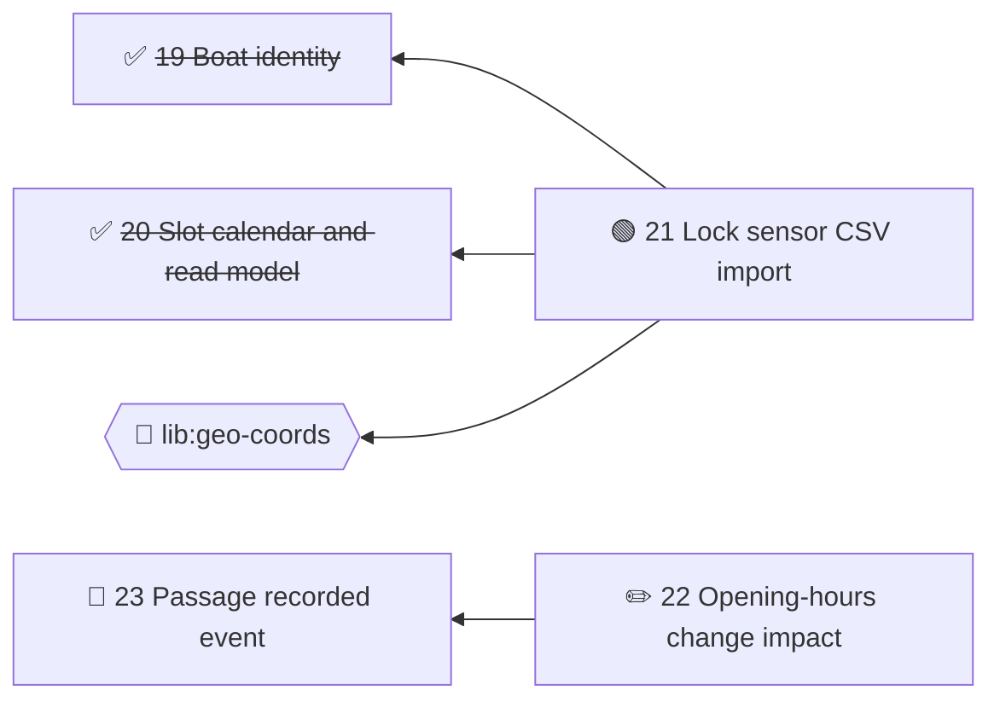

# Brindley — Format Specification (DRAFT)

*Design fully before anyone digs.*

> Status: **draft**, shaped by real-world use of numbered initiative files and the agents that
> implement them. See Appendix A for what that use showed.
>
> **Brindley** is named after James Brindley, engineer of Manchester's Bridgewater Canal, who
> worked his designs out completely before construction began.

## 1. Purpose

> **Terminology.** The unit of work is an **initiative**. People and agents may call them
> **tickets** or **issues**; tools treat the three words as the same thing.

A plain-Markdown, in-repo convention for planning work that AI agents (and humans) can read,
reason over, and act on. Each unit of work is an **initiative**: one Markdown file with a small
block of structured front-matter and a free-form, prose-first body. Initiatives live in git
alongside the code they describe, so planning is versioned, branched, reviewed and merged exactly
like code.

Typical lifecycle:

1. A human and an agent iterate on an initiative's design (on the main branch) until it is
   design-complete.
2. An implementing agent picks up one initiative whose dependencies are done, implements it (e.g.
   in a git worktree), rewrites the initiative to describe what is now true, marks it **done** in the
   same change, and merges back.

### Design principles

- **Works with zero tooling.** A text editor and an agent that reads Markdown are sufficient.
  Tooling makes it easier, never required.
- **Nothing moves.** A file's path never changes after creation, so links to it — and links from it
  to its assets — never break. Status lives in front-matter. Existing layouts that file
  initiatives into status folders (`completed/`, `deferred/`) are still read (§2), but tools never
  move files themselves.
- **Prose first.** Initiatives are design documents. The format standardises only the handful of
  facts tools need (number, status, dependencies); everything else is the author's.
- **Readable on GitHub.** Rendered files and collection READMEs should be useful to a human
  browsing the repo.
- **Small core, versioned.** The format carries a version number so it can evolve.
- **Docs say what is; initiatives say why.** Project documentation describes only the current
  code. History, rationale and rejected alternatives belong in initiatives, never in the docs
  (§7.2).

## 2. Collections and layout

> Examples throughout this spec use a fictional system that lets boat captains book a slot to take
> their boat through a canal lock, ascending or descending.

Initiatives are grouped into **collections** — the larger changesets (themes, epics, tickets)
that individual initiatives belong to. **A collection is a folder you mark as one**, anywhere in
the repo. There is no repo-level file: nothing sits above a collection.

```
docs/initiatives/LOCK-42/slot-booking/             # a collection (marked by its README)
  README.md                                        # marker, collection details + generated index (§8)
  19-boat-identity.md
  20-slot-calendar-and-read-model.md
  21-lock-sensor-import.md
  21-sensor-readings/                              # assets belonging to initiative 21 (§3)
    castlefield-lock-2026-09.csv
  39-paged-slot-listings.md
services/search/plans/                             # another collection, somewhere else entirely
  README.md
  1-query-parser.md
```

**The marker.** A folder is a collection when its `README.md` front-matter contains `brindley`
(the value is the format version):

```yaml
---
brindley: 1                           # marks this folder as a collection (format version 1)
name: slot-booking                    # name used in references; default: the folder name
aliases: [sb, slots]                  # extra short names for references (sb#21)
title: LOCK-42 lock slot booking      # display name; default: derived from the folder name
summary: Let captains book ascending and descending lock slots online
status: active                        # active | done | abandoned — of the changeset as a whole
owner: locks team
link: https://tracker.example.com/LOCK-42   # external ticket/epic, if any
agent: .github/agents/slot-booking.agent.md # implementing-agent workflow for this collection (§9)
docs: ["services/locks/docs/*.md"]          # what counts as project docs for this collection (§7.2)
types: [feature, bug, refactor, perf, docs, chore, spike]   # initiative types in use (§4.1)
tags:                                       # themes (§4.2)
  notifications: Telling captains about changes to their slots
ignore:                                     # .gitignore-style, relative to this folder
  - code-review/
  - "*-rationale.md"
dimensions:                                 # scoring dimensions (§4.3)
  priority: { values: [now, soon, later], default: soon, required: true }
  job_size: [1, 2, 3, 5, 8, 13]
folders:                                    # opt in: move initiatives into status folders
  done: completed
graph:                                      # what the generated dependency graph shows (§8.3)
  related: true                             # also draw ## Related links (default: off)
  themes: [box, icon]                       # group and mark initiatives by theme (default: off)
---
# LOCK-42 lock slot booking

Free-form introduction, above the generated content (§8).
```

Everything except `brindley` is optional. Marking an existing folder — for example one already
full of numbered initiative files — only adds front-matter to its README; nothing moves.

**Identity.** A collection is referred to by its **name**: the `name` field, else the folder name
(`slot-booking`, `plans`). Names must be unique in the repo; when two folders share a name, give
one an explicit `name`.

**Aliases** keep references short:

- **Explicit:** `aliases:` in the README front-matter (`aliases: [gates]` → `gates#22`).
- **Automatic:** the initials of a multi-word folder name — `lock-gate-maintenance` → `lgm`,
  `slot-booking` → `sb` — but only when no other collection's name or alias (explicit or
  automatic) is the same. An ambiguous automatic alias is simply not available; give the
  collections explicit aliases instead.
- **Lookup order:** name, explicit alias, automatic alias, then the folder path
  (`docs/initiatives/LOCK-42/slot-booking`). Matching ignores case.
- Names and explicit aliases must be unique across the repo (validation error otherwise) and use
  only letters, digits, `.`, `_` and `-`.
- Aliases are for people and tools (`lgm#22` in chat or a tool call). Inside initiative files,
  dependencies are ordinary relative links (§6), which every Markdown renderer can follow.

- Initiatives never declare their collection — it is always the folder they are in. There is no
  `collection:` field to drift out of sync.
- A file is an initiative iff its name matches `<number>-<slug>.md` and it sits in the collection
  folder or one of its immediate sub-folders.
- **Status folders** are read, not required. Sub-folders holding numbered initiatives —
  `completed/`, `deferred/`, `superseded/`, or anything mapped with `statuses:` — are part of the
  collection, and a file without a `status` in its front-matter takes its status from the folder
  name. Front-matter always wins. Tools never move a file unless the collection opts in.
- **Opting in to status folders:** a collection README's `folders:` maps statuses to folder names,
  e.g. `folders: { done: completed, abandoned: closed, superseded: closed }`. Then a status change
  moves the initiative — and its asset folder — into its status's folder, or back to the top of
  the collection for a status not listed (reopened work), rewriting every link to them in the
  repository; a `tidy` tool puts existing files where they belong. A folder named for one status is
  read as that status, without a `statuses:` entry.
- Asset folders (`<number>-…/`) and sub-folders that are collections themselves are not status
  folders. Sub-folders with no numbered files are ignored.
- **`ignore:`** lists paths Brindley should not treat as initiatives, with `.gitignore` semantics
  relative to the collection folder: `#` comments, `!` to re-include, a leading `/` to anchor to
  the collection folder, a trailing `/` for folders, and patterns without `/` matching at any
  depth. Use it for numbered files that aren't initiatives (a companion rationale, review notes).
  Ignored numbers are still never reused when a new initiative is numbered.
- Collection folders in gitignored paths (such as worktrees under an ignored directory) are not
  collections of this working tree.

**Renaming a collection** means changing its `name` (or, without one, its folder), which breaks
`"<name>#<n>"` references from other collections, and moving its folder breaks relative links.
The `rename_collection` tool moves the folder and rewrites both; validation catches anything
renamed by hand. Explicit aliases survive a rename.

## 3. Identity, filenames and assets

- Every initiative has a **number**: a positive integer, unique within its collection, allocated
  sequentially (next = highest existing + 1). People say "do 39"; the format keeps that.
- Filename: `<number>-<slug>.md`. The number may be zero-padded so files sort in order in a
  folder listing (`01-…`, `02-…`, … `10-…`); the number is its integer value (`01` is initiative 1).
- **Padding is per collection**: its width is the one most of its initiative files use — unpadded
  is width 1, `01-` width 2, `001-` width 3 — the wider on a tie, and 2 for a collection with no
  initiatives yet. New numbers are written at that width. A number too big for the width (`100-` at
  width 2) still fits; growing or shrinking the width is a rename of every file and asset folder,
  with links rewritten, which a tool does (`repad`).
- **The filename is permanent.** Retitling changes the H1 only; the slug is not updated. This is
  the price of never-breaking links.
- **Assets** (fixtures, diagrams, samples) live in a sibling directory whose name starts with the
  same number: `<number>-<anything>/`. Because neither file nor directory ever moves, relative links
  between them stay valid.
- **Referencing** an initiative:
  - same collection: by number in front-matter (`20`), by relative link in prose
    (`[20](20-slot-calendar-and-read-model.md)`);
  - another collection: `"<name>#<number>"` in front-matter (`"plans#1"`), relative link in
    prose (`[query parser](../../../../services/search/plans/1-query-parser.md)`). Tools find every
    collection in the repo, so these are checkable just like same-collection references.

**Collision handling.** Numbers are allocated where design happens — normally the main branch, one
author at a time — so collisions are rare. Tooling should reduce them further by scanning other
worktrees, branches and history before coining a number, and should never reuse the number of a
deleted initiative. When two branches do allocate the same number, it shows
up as two files with the same prefix after merge; validation (§10) flags it and the later one is
renumbered (a tool can do this, rewriting the few links involved).

## 4. Front-matter

YAML front-matter, delimited by `---`. Deliberately small:

```yaml
---
type: feature
status: draft
tags: [notifications]
owner: locks/core
updated: 2026-09-24
---
# Lock sensor CSV import
```

| Field        | Required | Type | Notes |
|--------------|----------|------|-------|
| `status`     | yes      | enum | See §5. |
| `type`       | no       | string | Kind of work: `feature`, `bug`, `refactor`, … (§4.1). |
| `status_note` | no      | string | One-line qualifier shown next to the status, e.g. "synchronous impact validation on publish" or "design proposal, no implementation yet". |
| `owner`      | no       | string | Owning team/module/person. |
| `updated`    | no       | ISO date | Last meaningful change. Tools set it; humans may. |
| `superseded_by` | conditional | integer | Required when `status: superseded`. |
| `tags`       | no       | list of strings | Themes this initiative belongs to, across collections (§4.2). |
| `docs`       | no       | list of paths | Project docs this initiative is expected to change (§7.2). Filled in during design, corrected during implementation. |
| `docs_impact` | on `done` | list of paths, or `none: <reason>` | Project docs actually updated, or an explicit statement that none were affected and why (§7.2). |
| `priority`, `impact`, `complexity`, … | per collection | one of the dimension's values | Scoring dimensions (§4.3). |
| `branch` | while `in-progress` | string | The branch the work is being built on. Tools set it when work starts and remove it when it stops. |

- The **title is the document's H1**, not a front-matter field — it is what people edit and what
  GitHub shows.
- The format version is declared once, on the collection (§2), not per file.
- Unknown fields are permitted and must be preserved by tools (extension point).

### 4.1 Initiative types

`type` is a free-form string saying what kind of work an initiative is. Suggested vocabulary:

| Type | Use for |
|------|---------|
| `feature` | New user- or caller-visible capability. |
| `bug` | Behaviour that is wrong today. |
| `refactor` | Internal restructuring with no behaviour change. |
| `perf` | Performance work. |
| `docs` | Documentation-only change. |
| `chore` | Build, dependencies, tooling, CI. |
| `spike` | Builds just enough to measure something specific and answer a question (§7.1). The code may become the basis of the real implementation. |

- A collection may declare its list with `types:` in its README front-matter. When declared, an
  unlisted `type` is a validation warning (typo protection); when not, any string is accepted.
- Common words are read as the type they stand for: `feat` → `feature`; `fix`, `bugfix` → `bug`;
  `raconiter`, `raconitering`, `reconnoitre`, `investigation` → `spike`.
- Type is descriptive, with one exception: a `spike` is held to `## Measures` instead of acceptance
  criteria before it starts, and records `## Findings` when done (§7.1).
- Tools may use it for grouping and filtering, and an implementing agent may use it to choose a
  commit type (e.g. `feature` → `feat`, `bug` → `fix` in Conventional Commits).

### 4.2 Tags: themes across collections

Three ways initiatives relate, each for a different job:

| Mechanism | Cardinality | Answers |
|-----------|-------------|---------|
| Collection (§2) | exactly one per initiative | *Which changeset is this part of?* |
| Links under `## Dependencies` / `## Related` (§6) | specific pairs | *What must come first? What informs this?* |
| `tags` | any number per initiative | *What else, anywhere in the repo, is about the same theme?* |

A tag is a theme that cuts across collections — e.g. `notifications` might cover an initiative
in `LOCK-42/slot-booking` and another in `search-rework`.

- Tags are lowercase kebab-case strings (`slot-pairing`, `accessibility`).
- A collection may declare themes with `tags:` in its README front-matter, as a map of tag →
  one-line description. Declarations from all collections are combined, since themes cut across
  them. Once any collection declares tags, an undeclared tag is a validation warning (typo
  protection) and descriptions are shown in the overview; when none do, any tag is accepted.
- Tags are descriptive only: they never affect readiness or lifecycle rules.

**Theme overview docs.** A theme can have one overview document: a non-numbered `.md` file in any
collection folder whose front-matter names the tag it covers. Initiatives join with the tag as
usual.

```yaml
---
theme: freshness
summary: Is this validation result still true, and how do I know cheaply?
icon: 🕰️
---
# Freshness and the validation report — orientation map
```

- The doc is written by people: an orientation map of how the theme is split across initiatives.
  Tools keep a generated block in it listing every initiative tagged with the theme, across all
  collections, with status and readiness (§8).
- Its `summary` (else its H1) becomes the tag's description; the doc declares the tag.
- Its optional `icon` marks the theme's initiatives in dependency graphs that ask for it (§8.3).
- Tools point to the doc wherever a tagged initiative is shown or handed to an agent.
- At most one doc per theme (validation error otherwise).

### 4.3 Scoring dimensions

Scoring dimensions say how important, valuable or hard an initiative is, so work can be filtered and
ordered by them. Each is a plain front-matter field whose value comes from a fixed, ordered set:

```yaml
priority: high
complexity: low
```

Every collection has these default dimensions, all optional:

| Dimension | Values, first ranks first |
|-----------|---------------------------|
| `priority` | `critical`, `high`, `medium`, `low` |
| `impact` | `high`, `medium`, `low` |
| `complexity` | `low`, `medium`, `high` — simpler work ranks ahead |

A collection declares its own under `dimensions:` in its README (§2). A declaration with a default's
name replaces that default:

```yaml
dimensions:
  priority: { values: [now, soon, later], default: soon, required: true }
  job_size: [1, 2, 3, 5, 8, 13]      # shorthand: just the values
```

- **`values`** — strings or numbers, listed in ranking order: the first ranks first. "Ranks first"
  means "do first", so a less-is-better dimension (size, effort, risk) is listed low to high.
- **`required: true`** — an initiative without a value is a validation warning.
- **`default`** — one of the values; an initiative without its own value is treated as having it
  when filtering, ordering and displaying. It is never written into the file.

Each initiative is checked against its own collection's dimensions, and ranked by them. A dimension
may not reuse a field with its own meaning (`status`, `type`, `tags`, …).

## 5. Status lifecycle

Core statuses (format v1; other words map onto these, see below):

```
draft ──► designed ──► in-progress ──► done
  │           │              │
  ├───────────┴──────────────┴──► abandoned | superseded
  └──► deferred (parked; from any open status, and back)
```

| Status        | Meaning |
|---------------|---------|
| `draft`       | Being designed ("proposed"). |
| `designed`    | Design complete: an implementing agent can act without asking product questions. |
| `in-progress` | Being implemented. |
| `done`        | Implemented and merged; the body describes what is true now (§7). |
| `abandoned`   | Will not be done. |
| `superseded`  | Replaced by another initiative (`superseded_by`). |
| `deferred`    | Parked: not abandoned, not being worked on. Never ready; shown separately. |

**Why work stopped.** Abandoned, superseded and deferred work says so at the top, in a callout
directly under the H1 that tools write and keep in step with the status and `status_note` — a
warning for abandoned work, a note for the others — and removes when the initiative is reopened:

```markdown
# Tag cloud in the collection README

> [!WARNING]
> **Abandoned** (2026-10-07): Mermaid can't draw a word cloud.
```

Abandoning requires a reason (kept as `status_note`); superseding and deferring take one
optionally, and a superseded initiative's callout links its replacement. A fuller account goes in an
`## Outcome` section, which belongs to the author: a reopen leaves it as the record.

**Status words.** Besides the core names, tools accept common aliases — `proposed`,
`exploratory`, `unresolved`, `design` (still designing) → `draft`; `ready`, `design complete`,
`design settled` → `designed`; `in-review`, `wip` → `in-progress`;
`parked`, `on-hold`, `backlog`, `future` → `deferred`; `complete`, `completed`, `implemented` → `done`;
`cancelled`, `rejected`, `dropped`, `won't do`, `wontfix` → `abandoned`; `replaced` → `superseded` — and a collection
can map its own words in its README front-matter:

```yaml
statuses:
  spiked: designed      # this collection's word → core status
  archive: done         # also works as a status folder name
```

The word as written is kept for display ("draft (proposed)"); behaviour follows the core status.

**Readiness is derived, never stored.** For an initiative with `status: designed`, each
dependency (§6) is classified as:

| Classification | Meaning |
|----------------|---------|
| satisfied      | linked initiative (same or other collection) with `status: done` |
| blocking       | linked initiative not yet `done` |
| external       | linked ticket URL (http/https) — cannot be checked; must be confirmed by the implementer |

The initiative is **ready** when nothing is blocking. External dependencies don't block readiness
but are always surfaced to the implementing agent. Storing readiness would mean rewriting dependants
whenever a dependency completes — the problem this format exists to avoid.

Transition rules:

- `draft → designed` requires no unresolved blocking open questions (§6).
- Moving backwards (e.g. `designed → draft` when a new question surfaces) is allowed.
- `done` is set **in the same commit as the implementation**, so status and code land together.

## 6. Body

The body is free-form prose. Recommended sections, roughly in order (names are conventions, not
requirements, except where marked):

| Section | Purpose |
|---------|---------|
| `## Goal` or `## Context` | What and why. |
| `## Dependencies` *(defined)* | **The** list of prerequisites, as links (below), each with why it is needed. |
| `## Related` *(defined)* | Non-blocking links: "informed by", "relates to", "generalised by". |
| `## See also`, or any other section | Plain cross-references with no Brindley meaning — e.g. back-references such as "depended on by 19", which would form a cycle under `## Dependencies`. |
| design sections | Whatever the initiative needs: proposed direction, mappings, compatibility, failure behaviour, testing… |
| `## Open Questions` *(defined)* | Task list of undecided points (below). |
| `## Acceptance criteria` *(defined)* | Bullet list of verifiable outcomes. The implementing agent's definition of done. |

**Dependencies are links.** Under the `## Dependencies` heading (matched case-insensitively), every
Markdown link is read:

- a link to an **initiative file** — in this collection or any other, including files in status
  folders — is a **dependency**: it blocks readiness until that initiative is done;
- an **http(s) link** (an issue in another tracker, say) is an **external** dependency: shown,
  never checked;
- any other link (a design doc, a code file) is just a link.

Links may sit in bullets or in prose, and the section stays free-form, so it says *why* as well
as *what*:

```markdown
## Dependencies

- [19 Boat identity](19-boat-identity.md) — readings are keyed by boat.
- Needs the [passage event](../../LOCK-43/lock-gate-maintenance/23-passage-recorded-event.md)
  to notify captains, and [LOCK-7](https://tracker.example.com/LOCK-7) upstream.
```

Links under `## Related` are read the same way but never block. Because the links are ordinary
relative paths, they work in every Markdown renderer; and since nothing moves, they never break.
A link to an initiative that *was* moved (in a legacy layout) still counts — tools match it by
filename and report where the file now is.

**Open questions** are list items under a heading named `Open questions` (matched
case-insensitively):

```markdown
## Open questions

- Must captains with a booked slot be re-notified when a lock's opening hours change, or is
  updating the published timetable enough?
- Should an ascending and a descending slot be paired, so the descending boat uses the water level
  the ascending boat leaves behind, or are slots in each direction booked independently?
- (implementation) One shared filter contract for slot listings, or per-endpoint typed filters?
- [x] Slot length? — 20 minutes per lock cycle, see Design.
```

- Each top-level list item is one question. Items may run over several lines and contain inline
  context, links and code — questions are often paragraphs, not one-liners.
- A plain bullet (`-`) or an unchecked task (`- [ ]`) is **unresolved**.
- **Resolving** a question, preferred: delete the item and record the decision where it belongs in
  the body (e.g. an `## Agreed direction` or `## Decisions` section, or a row in a rejected
  alternatives table). This keeps the document describing what is decided, not the history of
  deciding it. Alternative: keep it as `- [x] … — answer`.
- A question prefixed `(implementation)` is **deliberately delegated to the implementer** and does
  not block `designed` — including fact-finding the implementer can do better (e.g. "volumes are
  *unclear from code*"). It should be mirrored by an acceptance criterion requiring the decision to
  be settled and recorded (e.g. "A settled decision on …").

## 7. Completion

When an initiative becomes `done`, the implementer, in the same commit as the code:

- updates the project docs (§7.2) and records `docs_impact`;
- rewrites the main body into a concise, settled account of what was decided and built (no
  "we will"), pointing at the current-state docs for the detail;
- moves rejected alternatives and design debate into a final `## Appendix: Rejected alternatives`
  — kept, not deleted, but out of the way of the main account;
- keeps acceptance criteria and constraints unless they are preserved in the docs;
- sets `status: done` and `updated`.

A completed initiative is therefore the permanent **why** record for its change: the main body
says what was decided, the appendix says what was ruled out and why. The project docs say what
is (§7.2) and never repeat either.

```markdown
# Opening-hours change impact
… settled summary of the agreed direction, links to services/locks/docs/ …

## Acceptance criteria
…

## Appendix: Rejected alternatives
| Option | Why rejected |
|--------|--------------|
| Re-notify every captain with any future booking | Floods captains whose slots are unaffected by the change. |
```

The file stays where it is. Nothing else in the collection is edited, except the generated
README content.

### 7.1 Spikes

> James Brindley's notebook records him setting out on "a raconitering" — his spelling of a
> reconnoitre: going to look at the ground before committing to a route. `raconiter` is accepted
> as a type alias for `spike`.

A spike (`type: spike`) is an initiative whose purpose is to **measure something specific**. It
builds as much implementation as the measurement needs; its main output is knowledge, written
into the initiative. Two sections are defined for spikes:

```markdown
## Measures

- **Question:** can ascending and descending slots be paired without missing the 20-minute cycle?
- **Hypothesis:** pairing cuts water use by ~40% with no extra waiting.
- **Measure:** simulate a week of real bookings at Castlefield, paired vs unpaired.
- **Answer criteria:** yes if water use drops ≥ 30% and median wait rises < 2 minutes.
- **Time-box:** 3 days.

## Findings

- **Method:** …
- **Results:** water use −37%; median wait +1m10s.
- **Conclusion:** yes, with moderate confidence (one lock, one week).
- **Code:** adapt — branch `spike/slot-booking-24` @ 4f2a9c1; the simulator is reusable, the
  booking changes need the validation layer before shipping.
```

- `## Measures` is settled during design: a spike is not `designed` until it says what will be
  measured, how, and what result means yes or no.
- The code lives on its own branch and is **not merged** as part of the spike. It is not
  necessarily throwaway: if the spike proves useful, a follow-up implementation initiative links
  the spike under `## Dependencies` and builds on that branch.
- On completion, `## Findings` records the method, results against the answer criteria, the
  conclusion, and adopt / adapt / abandon for the code (with where it lives). Questions the
  findings answer are resolved in the initiatives that asked them. `docs_impact` is normally
  `none` — the knowledge lives in the initiative.

### 7.2 Project documentation describes only what is

Two kinds of document, with a strict division of labour:

| | Initiatives | Project docs |
|-|-------------|--------------|
| Describe | A change: why, options, decisions, rejected alternatives, acceptance criteria | The system as the code currently is |
| Tense | Future while open; settled once done | Present only |
| Lifetime | Frozen once done — a record | Edited with every change that affects it |
| Audience | People and agents deciding or implementing a change | Anyone using or changing the code today |

Which files are project docs is declared by `docs:` globs in each collection's README front-matter.
Files inside collection folders are never project docs. A pattern starting with `!` excludes what
it matches; patterns apply in order and the last match wins, as in `.gitignore`. That keeps a page
that is history by nature — a generated release history, say — out of the rules below:

```yaml
docs: ["site/**/*.md", "!site/releases.md"]
```

Each collection's list is read on its own: a file is project documentation if any collection's
list selects it.

Project docs must:

- **say what exists, how callers use it, its constraints and failure modes** — succinctly;
- **contain no history:** no "previously", "now", "was changed to", "we added", "introduced
  in", "no longer", "originally", "new"/"old" as time markers;
- **contain no ruled-out alternatives or design debate** — those stay in the initiative;
- **not link to initiatives** — docs must stand on their own as the code changes after the
  initiative is frozen. (Initiatives link to docs, never the reverse.);
- **say *unclear from code*** rather than guess, when the code does not establish a fact.

Every completed initiative records `docs_impact`: the doc files updated in the same commit, or
`none: <reason>` (e.g. `none: internal refactor, no public contract or data-shape change`). Silence
is not allowed — the implementer must decide and state, which is what keeps docs from drifting.

## 8. Generated README content

Each collection's `README.md` is its human entry point: front-matter (§2), a free-form
introduction written by people, plus a **generated block** that tools keep current. Theme
overview docs (§4.2) get the same treatment, with a generated list of the theme's initiatives:

```markdown
<!-- brindley:generated:begin — do not edit by hand; regenerate instead -->
…
<!-- brindley:generated:end -->
```

Rules for the generated block:

- **Entirely derived** from front-matter and H1s. Nothing in it is a source of truth.
- **Deterministic.** Same inputs, byte-identical output: stable ordering (by number), no
  timestamps, no counts that depend on when it ran. Regenerating an up-to-date README produces no
  diff, so it never causes churn or spurious merge conflicts.
- **On merge conflict**, discard both sides and regenerate — never hand-merge it.
- **Outside the markers is never touched** by tools.
- A repo with no tooling can omit the markers and maintain the README by hand.

### 8.1 Collection README

1. **Active** table — every initiative not `done`/`abandoned`/`superseded`:

   | # | Initiative | Type | Status | Ready / blocked by | Open Qs | Owner |
   |---|------------|------|--------|--------------------|---------|-------|
   | 21 | [Lock sensor CSV import](21-lock-sensor-import.md) | feature | designed | ✅ ready · ext: `lib:geo-coords` | 0 | — |
   | 22 | [Opening-hours change impact](22-opening-hours-change-impact.md) | feature | draft | ⛔ 23 | 7 | `locks/core` |
   | 39 | [Paged slot listings](39-paged-slot-listings.md) | perf | draft | — | 0 (+2 impl.) | `locks/api` |

   `status_note`, when present, is shown under the status.

   A collection can choose the columns of its Active and Completed tables in its README — an
   ordered list per table, replacing that table's defaults:

   ```yaml
   columns:
     active: [number, title, status, ready, priority, risk, owner]
     completed: [number, title, updated]
   ```

   Columns are `number`, `title`, `type`, `status`, `ready`, `questions`, `owner`, `tags`,
   `updated`, and any of the collection's scoring dimensions (§4.3), whose value is shown — in
   italics when it is the dimension's default — or `—`. Unknown names are validation warnings and
   left out.

2. **Dependency graph** (Mermaid) — see §8.3.

3. **Completed** table — `done` initiatives (#, linked title, `updated`); then a short
   **Closed** list for `abandoned`/`superseded` (with `superseded_by`, and the reason from `status_note`).

### 8.2 Overview of all collections

Because nothing sits above a collection, the repo-wide overview is generated on demand by tools
(the MCP server serves it as a resource) rather than written to a file:

1. **Collections** table: name (linked to its README), title, collection status, counts by
   initiative status, number ready.
2. **Cross-collection graph** (Mermaid): one node per collection with active work, an edge
   wherever an initiative in one depends on an initiative in another (labelled with the
   initiative numbers).
3. **Themes**: one sub-section per tag in use (declared description first), listing every
   initiative with that tag across all collections — `name#n`, linked title, type, status —
   active first, then done. This is the "show me everything about notifications" view.

### 8.3 Mermaid dependency graph

GitHub renders ```` ```mermaid ```` blocks natively, so the graph is a plain fenced block:

````markdown

````

- Each edge points **from an initiative to what it depends on** (`n22 --> n23`: 22 depends on 23),
  and the do-first work is on the left: Mermaid places an edge's start before its end, so the graph
  is drawn `flowchart RL`. Only dependencies are drawn, as solid edges.
- Each node's label starts with an emoji for its derived state, and closed work is struck through:

  | Mark | State |
  |------|-------|
  | ✅ + struck through | `done` |
  | 🟢 | ready: `designed` with nothing blocking |
  | 📐 | `designed`, still blocked |
  | 🚧 | `in-progress` |
  | ✏️ | `draft` |
  | ⏸️ | `deferred` |
  | 🪦 + struck through | `abandoned` |
  | ↪️ + struck through | `superseded` |
  | 🔗 | external dependency |

  There are no colours or styles, so the graph follows the viewer's Mermaid theme, light or dark.
- **Scope:** all active initiatives, plus any initiative an active one depends on, whatever its
  status (a `done` one shows the edge is satisfied). Other completed work is omitted — it would
  swamp the graph.
- External dependencies are hexagon nodes; initiatives in other collections are labelled
  `<collection>#<n>`.

A collection README's `graph:` settings change what its graph shows; each defaults to the above.
They apply to every graph drawn for the collection — its README and the `graph` tool — and not to
other collections' graphs or the repo-wide overview, which use the defaults.

| Setting | Values | Effect |
|---------|--------|--------|
| `direction` | `left-to-right` (default), `right-to-left`, `top-to-bottom`, `bottom-to-top` (or `LR`, `RL`, `TB`, `BT`) | Which side the do-first work is on. |
| `arrows` | `from` (default), `to` | `from`: every edge points away from the initiative whose file holds the link, at what it needs. `to`: every edge points at that initiative ("Y unblocks X"). |
| `related` | `true`, `false` (default) | Also draw `## Related` links, dotted, between initiatives already on the graph. |
| `show` | list of statuses, default none | Also include every initiative in these statuses (core names or aliases), e.g. `[done]`. |
| `external` | `true` (default), `false` | `false` leaves out external dependencies and other collections' initiatives, and their edges. |
| `themes` | `box`, `icon`, `label`, `true`, or a list | `box` groups each initiative in a box for its first tag. `icon` puts each of its themes' icons (§4.2; `[name]` without one) before its title, with a legend under the graph. `label` — or `true` — puts the theme names after its title. `box` combines with `icon` or `label`; `icon` and `label` together mean `label`. |
| `enabled` | `true` (default), `false` | `false` leaves the graph out of the README. |

Unknown settings and unusable values are validation warnings (§10), and fall back to the default.

## 9. Agent instructions

Two layers:

1. **Format rules** — generic, identical in every adopting repo. A snippet adopters paste into
   `AGENTS.md`/`CLAUDE.md` (or that tooling provides):

   ```markdown
   ## Initiatives
   Planned work lives in collections: folders whose `README.md` front-matter contains
   `brindley: 1`, one Markdown file per initiative. Format spec: <link>.
   - Never rename or move initiative files or their asset directories. Status is the
     `status` front-matter field.
   - Dependencies are the links under `## Dependencies` (non-blocking ones go under
     `## Related`). Implement only an initiative that is `designed` and whose linked initiatives
     are all `done`. Confirm external (http) dependencies yourself; report any you cannot confirm.
   - Ask about open questions before implementing; `(implementation)` questions are yours to
     settle — record the decision in the initiative.
   - If, while building, you reach a decision the initiative doesn't settle and that matters to
     what you build, don't guess: add it as an ordinary open question and stop to ask. The
     initiative stays in-progress, and readiness checks fail until it is resolved. Mark a
     question `(implementation)` only when the choice is genuinely yours to make.
   - When discussing open questions with the user: one at a time, in open chat (no form or
     multiple-choice prompts), grounded in the actual code (cite `path:line`; say "unclear from
     code" rather than guess), with concrete examples from the real domain. Record each decision
     in the initiative as it is made.
   - On completion, in the same commit as the code: update the project docs to describe the code
     as it now is — present tense, no history, no rejected alternatives, no links to initiatives —
     and record `docs_impact` (files updated, or `none: <reason>`); settle the initiative's
     wording, moving rejected alternatives into `## Appendix: Rejected alternatives`; set
     `status: done` and `updated`.
   - New initiative: next number in the collection, filename `<number>-<slug>.md`,
     `status: draft`, and a `type` (e.g. `feature`, `bug`, `refactor`).
   ```

2. **Repo workflow** — specific to the project: verification commands, docs to keep current,
   worktree/branch conventions, commit rules. Lives in a repo agent file, referenced from each
   collection's `agent:` field (collections may share one file or each have their own).

## 10. Validation rules

Errors:

1. Initiative numbers unique within a collection (catches post-merge collisions).
2. `status` present and in the core set; dates ISO-8601.
3. `superseded_by` refers to an existing initiative.
4. The dependency graph across all collections is acyclic.
5. `status: superseded` has `superseded_by`.
6. Collection names are unique in the repo.
7. A scoring dimension's value is one of its declared values; a `dimensions:` declaration has
   values, no duplicates, a `default` among them, and doesn't reuse a reserved field name (§4.3).

Warnings:

8. `status: designed` with unresolved non-`(implementation)` open questions.
9. `status: in-progress`/`done` with unresolved open questions.
10. Relative links that do not resolve.
11. Asset directories whose number matches no initiative.
12. Missing H1.
13. A collection README's generated block is out of date.
14. Collection `status: done` while any of its initiatives is still `draft`/`designed`/`in-progress`.
15. `status: done` without `docs_impact`.
16. A project doc (per `docs:` globs) that links into a collection folder.
17. History phrasing in a project doc (heuristic — see §7.2 list).
18. `type` not in its collection's `types:` list, when one is declared.
19. A tag not declared by any collection's `tags:`, when any are declared; or a tag that isn't kebab-case.
20. Front-matter status contradicts the status folder the file is in.
21. The collection files a status in a status folder (e.g. done in `completed/`), but this file
    with that status is elsewhere.
22. A status written in the body (`**Status:** …` or `## Status`) disagrees with the file's status.
23. A number padded differently from the collection's width (§3), or a collection whose highest
    number has reached 80% of its width (8, 80, 800 …).
24. A required scoring dimension (§4.3) without a value.
25. A collection README's `graph:` with an unknown setting or an unusable value (§8.3).
26. No status recorded (no front-matter `status`, not in a status folder), but the body states one in a
    `**Status:**` line or a `## Status` section that maps to a core status — record it.
27. `status: abandoned` without a reason (`status_note`), unless the status comes from a status folder.
28. A collection README's `columns:` with an unknown table or column, or a value that isn't a list.
29. A collection README's `folders:` listing something that isn't a status or alias, or a value that isn't a
    plain folder name.
30. An in-progress initiative whose `branch` doesn't exist, locally or as a remote-tracking branch.

Broken-link warnings name the new location when the linked file has moved within the collection.

## 11. Migration from the numbered + `completed/` layout

1. Mark the folder as a collection: add `brindley: 1` (and any details) to its README
   front-matter.
2. Move `completed/*` back into the collection with `status: done`.
3. Convert status/owner/last-updated metadata into front-matter. Both styles seen in practice
   must be recognised:
   - sections: `## Status` / `## Owner` / `## Last updated` followed by a paragraph;
   - bold lead-in lines: `**Status:** …`, `**Owner module:** …`, `**Last updated:** …`.

   Map status wording to the enum (e.g. "Proposed." / "`draft`" → `draft`); any trailing
   qualifier ("-- synchronous impact validation on publish", "— design proposal, no
   implementation yet") becomes `status_note`.
4. Make sure every prerequisite under `## Dependencies` is a link to its initiative (bare
   mentions like "`30`" become links), and move non-blocking mentions ("relates to", "informed
   by") under `## Related`.
5. Rewrite every `completed/…` link **once**, and replace the hand-written README tables/graph with
   the generated index — all in a single migration commit.

## Open Questions

- [x] **Name** — Brindley; collection marker key `brindley:`.
- [x] Status mapping — `deferred` joins the core set; common words are aliases; collections can
      map their own words with `statuses:`; legacy status folders are read (§2, §5).
- [x] Cross-collection dependencies — `"<name>#<n>"`, checkable because tools find every collection (§3).
- [x] Where do initiatives live? — in any folder marked as a collection by its README; there is no
      repo-level root or config file (§2).
- [x] **Name for a collection** — "collection": deliberately vague, so it fits themes, epics, tickets or changesets alike.
- [x] Number scope — unique **per collection**. Each changeset counts from 1, existing numbering
      migrates unchanged, and `"<collection>#<n>"` disambiguates across collections.
- [x] Is a front-matter-free mode worth supporting (status as a `## Status` section, as today), or
      is front-matter acceptable to adopters? — No: a status in the body is read (the
      `status-inferable` finding) and tools record it in front-matter, rather than being a second
      way to keep it.
- [ ] Should `done` record the implementing merge commit or PR? (A commit can't contain its own
      SHA; the merge commit could be recorded by a follow-up, or a PR URL used.) — planned as
      initiatives#26.
- [x] Record who/what is implementing an `in-progress` item (branch/worktree name) to stop two
      agents picking up the same one? — Yes: the `branch` field, recorded when work starts; tools
      also look across other worktrees and branches, and refuse to start work already in progress
      elsewhere.
- [x] What happens to rejected alternatives on completion? — they move into a final
      `## Appendix: Rejected alternatives` in the completed initiative (§7).
- [x] Typed relations? One initiative may be "generalised by" another, or "hand over" a case to
      another. Plain `## Related` links lose the direction and kind; would a convention like
      "generalised by: [44](…)" be worth recognising? — No: tools don't read meaning from wording.
      `## Related` (non-blocking) and plain sections such as `## See also` carry it in prose.
      would let the index show it. Worth the extra syntax?
- [x] Should the format require the question list to be a task list (`- [ ]`) for reliable
      parsing, or accept plain bullets as real-world files use? — Accept both.

## Appendix A — What real-world use showed

This format grew out of an existing practice: numbered Markdown initiatives in a repo, moved into
a `completed/` folder when done, with hand-maintained README tables and dependency graphs, and an
implementing agent that works in a git worktree. What that practice showed, and how it shaped the
spec:

| Observation | Effect on this spec |
|-------------|---------------------|
| Moving finished initiatives into `completed/` breaks every link to them, forcing mass rewrites. | Nothing moves; status is front-matter (§1, §5). |
| Initiatives live in nested, ticket- or theme-scoped directories, each with a hand-maintained README summary table and dependency graph. | Collections are marked folders, wherever they live (§2); generated README content (§8) replaces the hand-maintained tables/graph — the second mass-rewrite target. |
| Numbers are used conversationally ("do 39", "completed `30`"), unpadded. Design happens on main. | Sequential numbers kept; random IDs rejected (§3). |
| Initiatives link to their own asset directories (fixtures, samples). | Asset directory rule (§3). Moving files would also break these links. |
| Dependencies mix initiatives, external modules, and soft "informed by but does not depend on" links, each with a reason. | The `## Dependencies` section *is* the dependency list: links to initiatives block, http links are external; non-blocking links go under `## Related` (§6). |
| Status wording drifts across files ("Proposed.", "`draft` — design proposal…", `**Status:** Proposed -- <qualifier>`), as sections or bold lead-in lines. | Closed status enum in front-matter, `status_note` for the qualifier; migration recognises both metadata styles (§4, §5, §11). |
| Many initiatives have no Open Questions section; some deliberately leave decisions to the implementer via acceptance criteria. | Open questions stay optional; `(implementation)` questions don't block `designed` (§6). |
| Where present, open questions are plain, multi-sentence bullets under `## Open questions`, some fact-finding ("unclear from code"). Settled points move into an "Agreed direction" section or a rejected-alternatives table rather than being ticked off. | Heading matched case-insensitively; plain bullets = unresolved; multi-line items; preferred resolution is "delete the question, record the decision in the body" (§6). |
| Relationships come in several kinds in prose: depends on, relates to, hands a case over to, is generalised by. | `## Related` covers all non-blocking kinds; the prose explains which. Typed relations deferred (Open Questions). |
| Initiatives end with `## Acceptance criteria`, which the implementing agent treats as the definition of done. | Acceptance criteria are a defined section (§6). |
| The agent rewrites a completed initiative into current-state wording, and must decide and state which project docs it updated. | Completion rules and `docs_impact` (§7). |
| The agent file mixes generic lifecycle rules with repo-specific workflow (build tool, docs, worktrees). | Two-layer agent instructions (§9); collection `agent:` pointer. |
