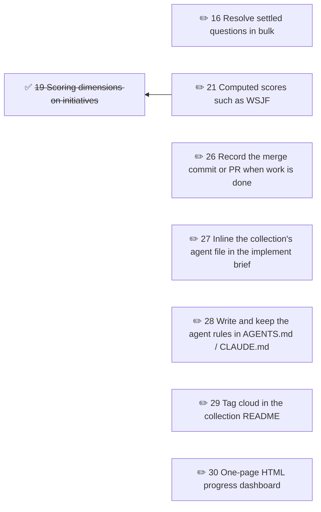

# Brindley roadmap

Planned work on Brindley itself: tools specified in MCP-SERVER.md but not yet built, and other changes to the format and server.

<!-- brindley:generated:begin — do not edit by hand; regenerate instead -->

### Active

| # | Initiative | Type | Status | Ready / blocked by | Open Qs | Owner |
|---|------------|------|--------|--------------------|---------|-------|
| 16 | [Resolve settled questions in bulk](16-resolve-settled-questions-in-bulk.md) | feature | draft | — | 1 | — |
| 21 | [Computed scores such as WSJF](21-computed-scores-such-as-wsjf.md) | feature | draft | — | 2 | — |
| 26 | [Record the merge commit or PR when work is done](26-record-the-merge-commit-or-pr-when-work-is-done.md) | feature | draft | — | 1 | — |
| 27 | [Inline the collection's agent file in the implement brief](27-inline-the-collection-s-agent-file-in-the-implement-brief.md) | feature | draft | — | 1 | — |
| 28 | [Write and keep the agent rules in AGENTS.md / CLAUDE.md](28-write-and-keep-the-agent-rules-in-agents-md-claude-md.md) | feature | draft | — | 1 | — |
| 29 | [Tag cloud in the collection README](29-tag-cloud-in-the-collection-readme.md) | feature | draft | — | 3 | — |
| 30 | [One-page HTML progress dashboard](30-one-page-html-progress-dashboard.md) | feature | draft | — | 3 | — |

### Dependencies

### Themes

- [**adoption**](adoption.md) — Bringing an existing hand-written folder under Brindley with less hand-editing (GitHub #5) · 1 open, 8 closed or deferred
- [**dependency-links**](dependency-links.md) — Telling blocking dependencies from other cross-references, and editing them (GitHub #3) · 0 open, 2 closed or deferred
- [**questions**](questions.md) — Open questions during design and implementation, and tidying settled ones (GitHub #6, #7) · 1 open, 1 closed or deferred
- [**status-recording**](status-recording.md) — Recording an initiative's status outside a lifecycle transition (GitHub #4) · 0 open, 3 closed or deferred
- **text** — Changes only to what tools say — messages, findings and prompts — not to what they do · 0 open, 4 closed or deferred

### Deferred

- 1 [migrate tool for numbered + completed/ collections](01-migrate-tool-for-numbered-completed-collections.md)

### Completed

| # | Initiative | Type | Updated |
|---|------------|------|---------|
| 2 | [renumber tool for post-merge number collisions](done/02-renumber-tool-for-post-merge-number-collisions.md) | feature | 2026-10-07 |
| 3 | [rename_collection tool](done/03-rename-collection-tool.md) | feature | 2026-10-07 |
| 4 | [Cycle errors advise where back-references belong](done/04-flag-reverse-direction-links-under-dependencies.md) | feature | 2026-10-07 |
| 5 | [set_dependencies explains links it cannot remove](done/05-set-dependencies-removes-links-inside-prose.md) | feature | 2026-10-07 |
| 6 | [Record status without lifecycle checks](done/06-record-status-without-lifecycle-checks.md) | feature | 2026-10-07 |
| 7 | [Infer a missing status from the initiative's prose](done/07-infer-a-missing-status-from-the-initiative-s-prose.md) | feature | 2026-10-07 |
| 8 | [Fix mode for mechanical validate findings](done/08-fix-mode-for-mechanical-validate-findings.md) | feature | 2026-10-07 |
| 9 | [Suggest a home for companion notes](done/09-suggest-an-ignore-pattern-for-companion-notes.md) | feature | 2026-10-07 |
| 10 | [Name the base folder in path errors](done/10-name-the-base-folder-in-path-errors.md) | feature | 2026-10-07 |
| 11 | [batch_update tool](done/11-batch-status-backfill-tool.md) | feature | 2026-10-07 |
| 12 | [Themes section in the collection README](done/12-themes-overview-and-tag-cloud-in-the-collection-readme.md) | feature | 2026-10-07 |
| 13 | [Consistent zero-padded numbering](done/13-consistent-zero-padded-numbering.md) | feature | 2026-10-07 |
| 14 | [README front-matter controls what the dependency graph shows](done/14-readme-front-matter-controls-what-the-dependency-graph-shows.md) | feature | 2026-10-07 |
| 17 | [Record why an initiative was abandoned](done/17-record-why-an-initiative-was-abandoned.md) | feature | 2026-10-07 |
| 18 | [Work on the worktree the agent is implementing in](done/18-work-on-the-worktree-the-agent-is-implementing-in.md) | feature | 2026-10-07 |
| 19 | [Scoring dimensions on initiatives](done/19-rank-initiatives-by-scoring-dimensions.md) | feature | 2026-10-07 |
| 20 | [Configurable columns in the generated README tables](done/20-sorted-and-filtered-views-in-the-generated-readme.md) | feature | 2026-10-07 |
| 22 | [Release history and what's new on the docs site](done/22-release-history-and-what-s-new-on-the-docs-site.md) | docs | 2026-10-07 |
| 23 | [Exclusions in docs globs](done/23-exclusions-in-docs-globs.md) | feature | 2026-10-07 |
| 24 | [Opt-in status folders that Brindley keeps in step](done/24-opt-in-status-folders-that-brindley-keeps-in-step.md) | feature | 2026-10-07 |
| 25 | [Show where in-progress work is being built](done/25-show-where-in-progress-work-is-being-built.md) | feature | 2026-10-07 |
| 31 | [Spike: progress dashboard designs from git history](done/31-spike-progress-dashboard-designs-from-git-history.md) | spike | 2026-10-09 |

### Closed

- 15 [Show in-progress work blocked on an open question](15-show-in-progress-work-blocked-on-an-open-question.md) (abandoned — Not needed: the stop-and-ask rule shipped in 1.1.1, and check_ready, validate's open-questions warning and the Open Qs column already show the blocked state)

<!-- brindley:generated:end -->
