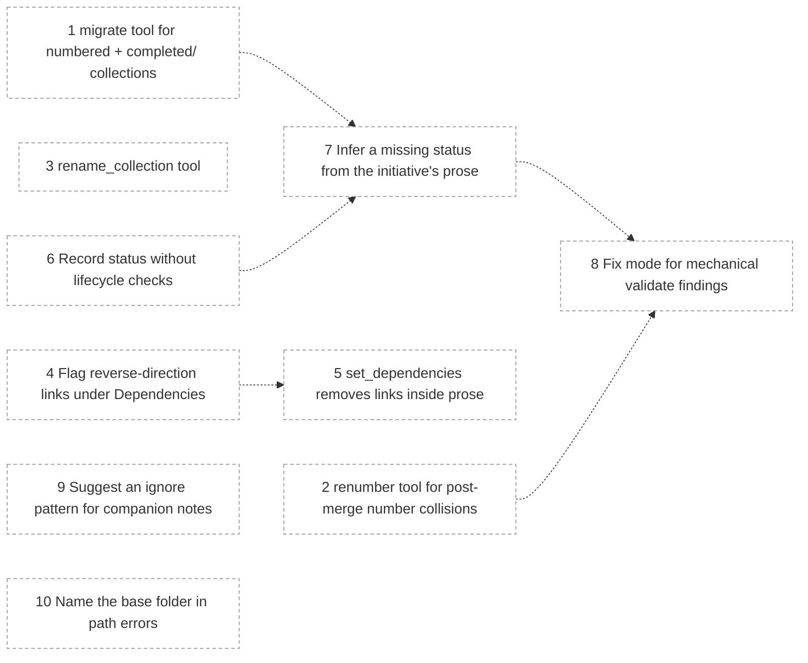

# Brindley roadmap

Planned work on Brindley itself: tools specified in MCP-SERVER.md but not yet built, and other changes to the format and server.

<!-- brindley:generated:begin — do not edit by hand; regenerate instead -->

### Active

| # | Initiative | Type | Status | Ready / blocked by | Open Qs | Owner |
|---|------------|------|--------|--------------------|---------|-------|
| 1 | [migrate tool for numbered + completed/ collections](1-migrate-tool-for-numbered-completed-collections.md) | feature | draft | — | 1 | — |
| 2 | [renumber tool for post-merge number collisions](2-renumber-tool-for-post-merge-number-collisions.md) | feature | draft | — | 0 | — |
| 3 | [rename_collection tool](3-rename-collection-tool.md) | feature | draft | — | 0 | — |
| 4 | [Flag reverse-direction links under Dependencies](4-flag-reverse-direction-links-under-dependencies.md) | feature | draft | — | 1 | — |
| 5 | [set_dependencies removes links inside prose](5-set-dependencies-removes-links-inside-prose.md) | feature | draft | — | 1 | — |
| 6 | [Record status without lifecycle checks](6-record-status-without-lifecycle-checks.md) | feature | draft | — | 1 | — |
| 7 | [Infer a missing status from the initiative's prose](7-infer-a-missing-status-from-the-initiative-s-prose.md) | feature | draft | — | 1 | — |
| 8 | [Fix mode for mechanical validate findings](8-fix-mode-for-mechanical-validate-findings.md) | feature | draft | — | 1 | — |
| 9 | [Suggest an ignore pattern for companion notes](9-suggest-an-ignore-pattern-for-companion-notes.md) | feature | draft | — | 1 | — |
| 10 | [Name the base folder in path errors](10-name-the-base-folder-in-path-errors.md) | feature | draft | — | 0 (+1 impl.) | — |

### Dependencies

### Completed

_None._

<!-- brindley:generated:end -->
