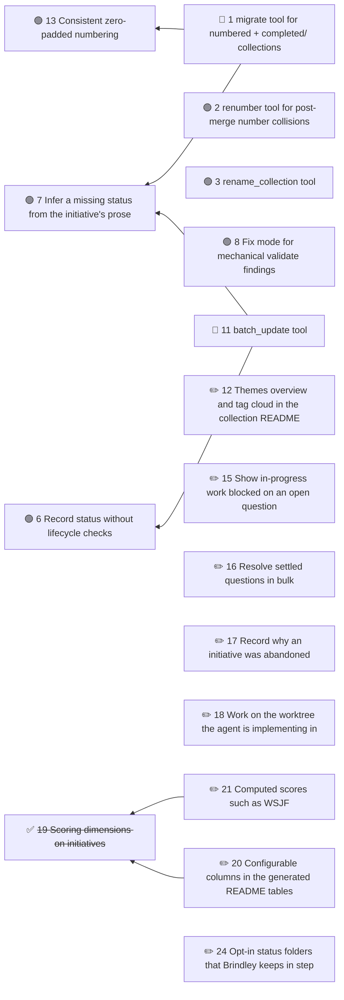

# Brindley roadmap

Planned work on Brindley itself: tools specified in MCP-SERVER.md but not yet built, and other changes to the format and server.

<!-- brindley:generated:begin — do not edit by hand; regenerate instead -->

### Active

| # | Initiative | Type | Status | Ready / blocked by | Open Qs | Owner |
|---|------------|------|--------|--------------------|---------|-------|
| 1 | [migrate tool for numbered + completed/ collections](1-migrate-tool-for-numbered-completed-collections.md) | feature | designed | ⛔ 7, 13 | 0 | — |
| 2 | [renumber tool for post-merge number collisions](2-renumber-tool-for-post-merge-number-collisions.md) | feature | designed | ✅ ready | 0 | — |
| 3 | [rename_collection tool](3-rename-collection-tool.md) | feature | designed | ✅ ready | 0 | — |
| 6 | [Record status without lifecycle checks](6-record-status-without-lifecycle-checks.md) | feature | designed | ✅ ready | 0 | — |
| 7 | [Infer a missing status from the initiative's prose](7-infer-a-missing-status-from-the-initiative-s-prose.md) | feature | designed | ✅ ready | 0 | — |
| 8 | [Fix mode for mechanical validate findings](8-fix-mode-for-mechanical-validate-findings.md) | feature | designed | ✅ ready | 0 | — |
| 11 | [batch_update tool](11-batch-status-backfill-tool.md) | feature | designed | ⛔ 6, 7 | 0 | — |
| 12 | [Themes overview and tag cloud in the collection README](12-themes-overview-and-tag-cloud-in-the-collection-readme.md) | feature | draft | — | 3 | — |
| 13 | [Consistent zero-padded numbering](13-consistent-zero-padded-numbering.md) | feature | designed | ✅ ready | 0 | — |
| 15 | [Show in-progress work blocked on an open question](15-show-in-progress-work-blocked-on-an-open-question.md) | feature | draft | — | 2 | — |
| 16 | [Resolve settled questions in bulk](16-resolve-settled-questions-in-bulk.md) | feature | draft | — | 1 | — |
| 17 | [Record why an initiative was abandoned](17-record-why-an-initiative-was-abandoned.md) | feature | draft | — | 2 | — |
| 18 | [Work on the worktree the agent is implementing in](18-work-on-the-worktree-the-agent-is-implementing-in.md) | feature | draft | — | 2 | — |
| 20 | [Configurable columns in the generated README tables](20-sorted-and-filtered-views-in-the-generated-readme.md) | feature | draft | — | 1 | — |
| 21 | [Computed scores such as WSJF](21-computed-scores-such-as-wsjf.md) | feature | draft | — | 2 | — |
| 24 | [Opt-in status folders that Brindley keeps in step](24-opt-in-status-folders-that-brindley-keeps-in-step.md) | feature | draft | — | 3 | — |

### Dependencies

### Completed

| # | Initiative | Type | Updated |
|---|------------|------|---------|
| 4 | [Cycle errors advise where back-references belong](4-flag-reverse-direction-links-under-dependencies.md) | feature | 2026-10-07 |
| 5 | [set_dependencies explains links it cannot remove](5-set-dependencies-removes-links-inside-prose.md) | feature | 2026-10-07 |
| 9 | [Suggest a home for companion notes](9-suggest-an-ignore-pattern-for-companion-notes.md) | feature | 2026-10-07 |
| 10 | [Name the base folder in path errors](10-name-the-base-folder-in-path-errors.md) | feature | 2026-10-07 |
| 14 | [README front-matter controls what the dependency graph shows](14-readme-front-matter-controls-what-the-dependency-graph-shows.md) | feature | 2026-10-07 |
| 19 | [Scoring dimensions on initiatives](19-rank-initiatives-by-scoring-dimensions.md) | feature | 2026-10-07 |
| 22 | [Release history and what's new on the docs site](22-release-history-and-what-s-new-on-the-docs-site.md) | docs | 2026-10-07 |
| 23 | [Exclusions in docs globs](23-exclusions-in-docs-globs.md) | feature | 2026-10-07 |

<!-- brindley:generated:end -->
