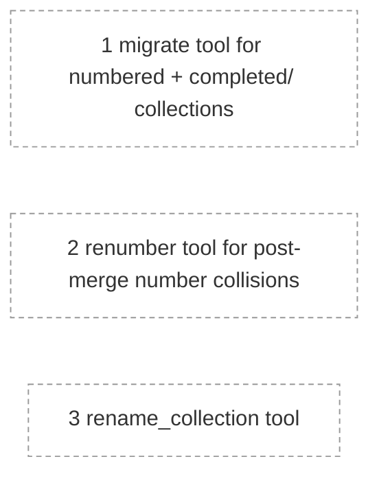

# Brindley roadmap

Planned work on Brindley itself: tools specified in MCP-SERVER.md but not yet built, and other changes to the format and server.

<!-- brindley:generated:begin — do not edit by hand; regenerate instead -->

### Active

| # | Initiative | Type | Status | Ready / blocked by | Open Qs | Owner |
|---|------------|------|--------|--------------------|---------|-------|
| 1 | [migrate tool for numbered + completed/ collections](1-migrate-tool-for-numbered-completed-collections.md) | feature | draft | — | 1 | — |
| 2 | [renumber tool for post-merge number collisions](2-renumber-tool-for-post-merge-number-collisions.md) | feature | draft | — | 0 | — |
| 3 | [rename_collection tool](3-rename-collection-tool.md) | feature | draft | — | 0 | — |

### Dependencies

### Completed

_None._

<!-- brindley:generated:end -->
